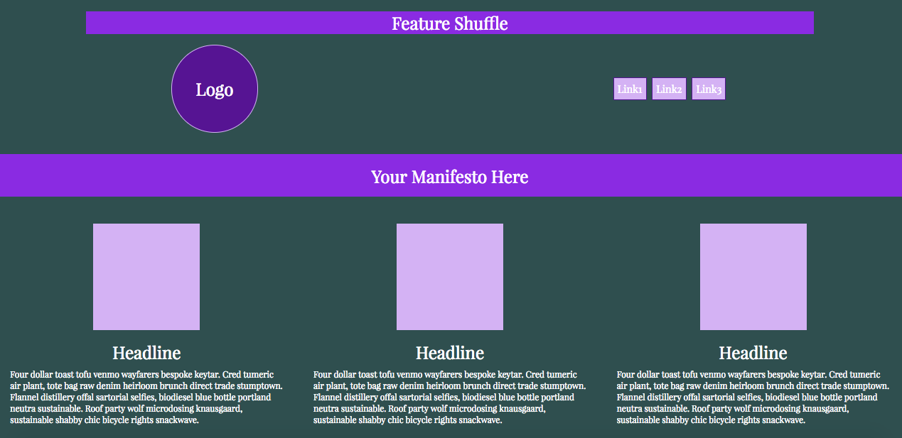
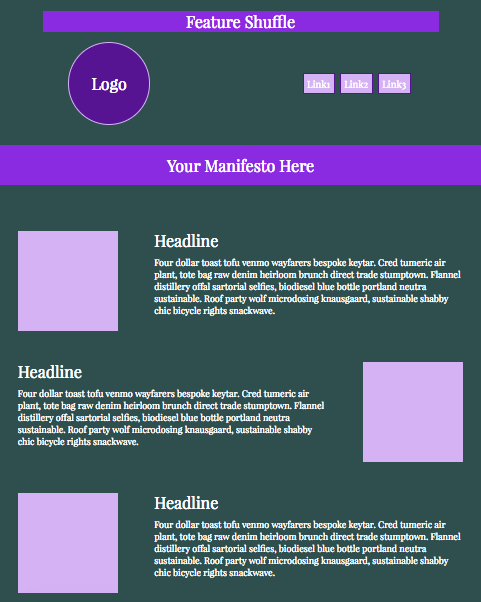
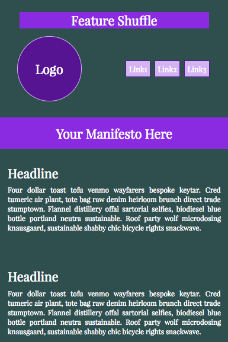

# _Flex ONLY Feature Shuffle Template_

#### _{A responsive site using flexbox instead of a grid}, {Jan 6, 2017}_

#### By _**Kyle Lange**_

### See it [live here.](http://codepen.io/kylelange/pen/ZLGJLb)

## Description:

This pen is a FLEXBOX ONLY template for a site with an image/icon feature shuffle.  Content is also hidden/rearranged at different screen sizes.  It was created without a gird and can be used for all web needs.

idea from CMV Blog [here:](https://codemyviews.com/blog/5-really-useful-responsive-web-design-patterns)

Need vendor prefixes with this template?

Atom:

1. in git:

    $ apm install autoprefixer

2. press cmd+shift+p to pull up the command palette.

3. type in [autoprefixer](https://atom.io/packages/command-palette) in the window provided at the top. The program will auto complete all vendor prefixes known as of the most current release.

## Setup/Installation Requirements

1. Download this repo using your terminal: git clone repo-name pasted here

2. View the code by drag-and-dropping the file into your [favorite text editor](https://atom.io)

3. run/check-out the program by dropping the index/html file from your folder into your web browser

4. Install Sass/Bourbon/Neat:

   in your console write:

           _gem install sass_

   If you get an error message try:

           _sudo gem install sass_

 5. Watch your Sass project/ make changes with:

         _sass --watch scss:css_

## Known Bugs

_There are no known bugs as of the last commit. Please send an ISSUE on github in the repository if you see something I have not._

## Support and contact details

For questions or comments, please __email  [Kyle here.](baronsintrees@gmail.com)__

## Technologies Used

* HTML5
* CSS3 with Sass, Bourbon and Neat

### License

Copyright (c) 2016 **_Kyle Lange_**

This program is free software: you can redistribute it and/or modify
    it under the terms of the GNU General Public License as published by
    the Free Software Foundation, either version 3 of the License, or
    (at your option) any later version.

    This program is distributed in the hope that it will be useful,
    but WITHOUT ANY WARRANTY; without even the implied warranty of
    MERCHANTABILITY or FITNESS FOR A PARTICULAR PURPOSE.  See the
    GNU General Public License for more details.

    You should have received a copy of the GNU General Public License
    along with this program.  If not, see <http://www.gnu.org/licenses/>.
